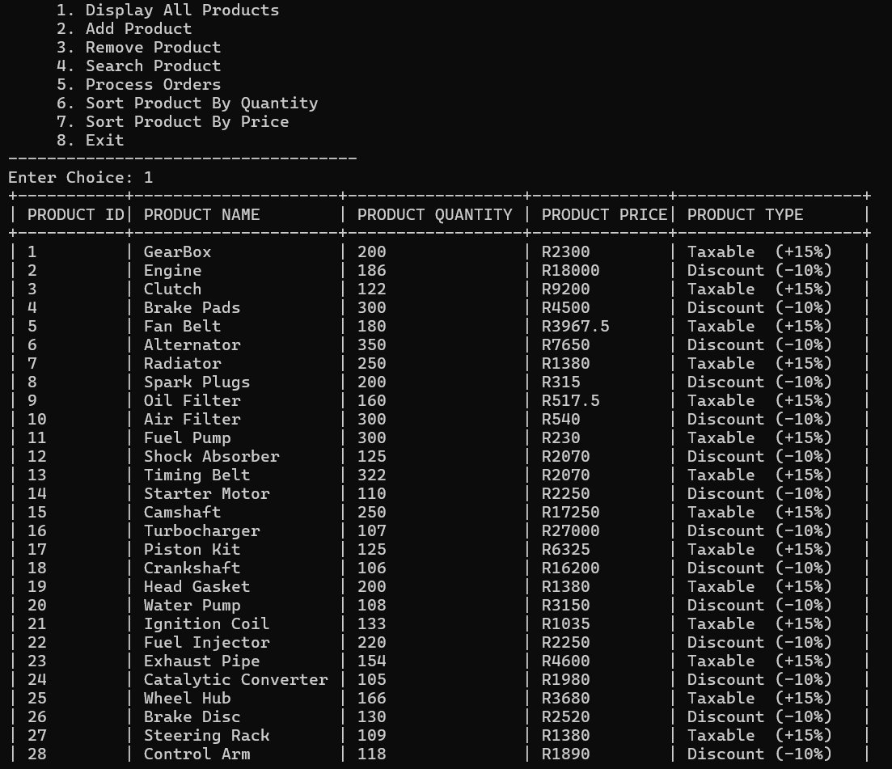
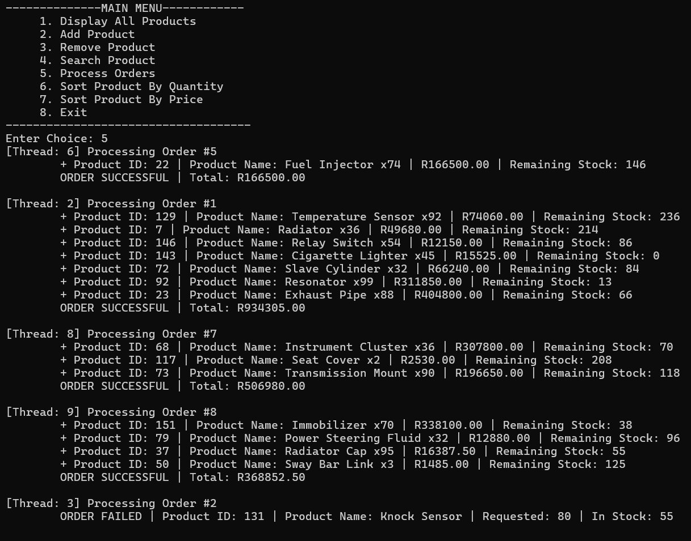
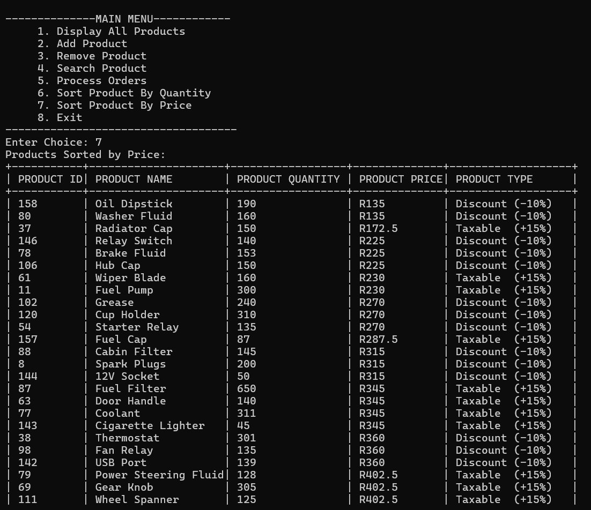
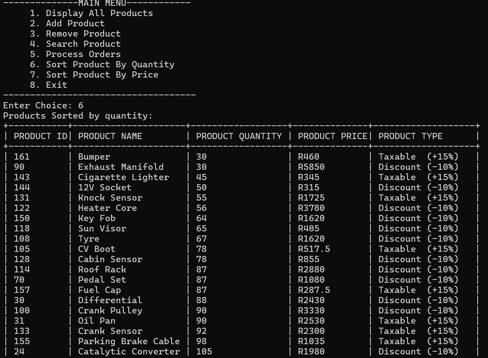
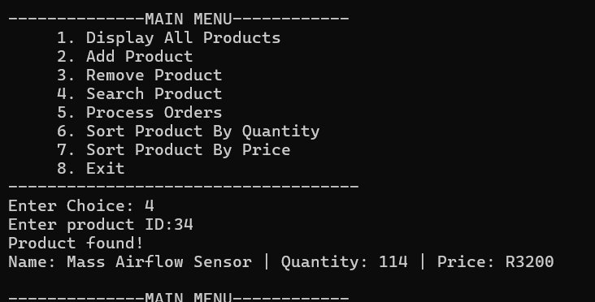
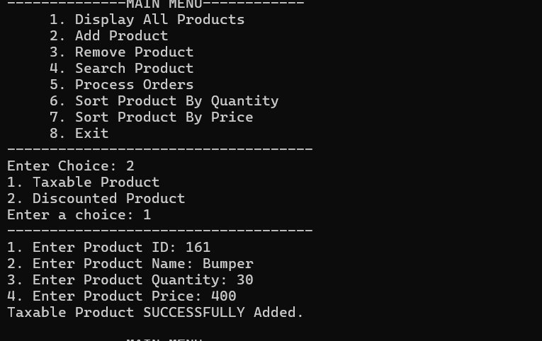
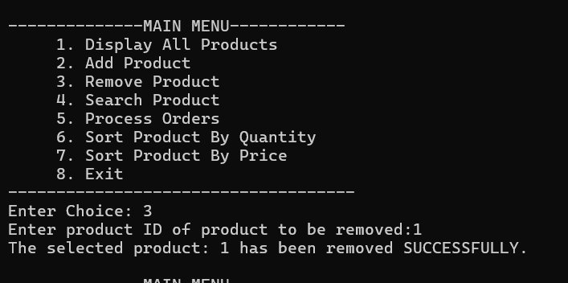

# Multi-Threaded Inventory & Order Processing System

A **C++ console application** that simulates a concurrent warehouse inventory and order processing system using multi-threading, mutex synchronization, STL containers, and smart pointers. Developed as a COMP315 semester project at the **University of KwaZulu-Natal (UKZN)**.

---

## 📋 Overview

The system simulates a real-world trading environment where multiple warehouse units (threads) operate simultaneously, accessing and updating a shared inventory of car parts. The primary objective is to demonstrate how concurrent operations can be handled safely while maintaining data integrity using modern C++ concepts.

> *Group Name: **The Code Fellas***

---

## ✨ Features

### 🖥️ Main Menu
- Display All Products
- Add Product (Taxable or Discounted)
- Remove Product
- Search Product
- Process Orders (Multi-threaded)
- Sort Products By Quantity
- Sort Products By Price
- Exit

### ⚙️ Core Functionality
- **Multi-threading** — 20+ threads simulate concurrent warehouse operations
- **Thread Safety** — mutex-based synchronization prevents race conditions
- **OOP Design** — abstract Product base class with TaxableProduct (+15%) and DiscountedProduct (-10%)
- **Smart Pointers** — std::shared_ptr for safe memory management across threads
- **STL Containers** — std::map for O(log n) product operations, std::vector for orders and threads

---

## 🖥️ Screenshots

### Display All Products


### Processing Orders (Multi-threaded)


### Sort By Price


### Sort By Quantity


### Search Product


### Add Product


### Remove Product


---

## 🛠️ Tech Stack

| Technology | Details |
|---|---|
| Language | C++ (C++17) |
| IDE | Code::Blocks / VS Code |
| Threading | std::thread |
| Synchronization | std::mutex, std::lock_guard |
| Memory Management | std::shared_ptr, std::unique_ptr |
| Data Structures | std::map, std::vector |
| Paradigm | Object-Oriented Programming |

---

## 📁 Project Structure

```
CodeFellazProject/
├── main.cpp                  # Entry point & CLI menu
├── Product.h / product.cpp   # Abstract base class
├── TaxableProduct.h / .cpp   # Taxable product (+15% tax)
├── DiscountedProduct.h / .cpp # Discounted product (-10%)
├── Inventory.h / Inventory.cpp # Core inventory manager
├── Order.h / Order.cpp       # Order class
└── images/                   # Screenshots
```

---

## 🏗️ System Architecture

```
User Interface (CLI)
        ↓
Inventory Manager
  ├── addProduct()
  ├── removeProduct()
  ├── searchProduct()
  ├── displayProducts()
  ├── sortByPrice()
  ├── sortByQuantity()
  ├── processOrder()
  └── std::mutex (thread safety)
        ↓
Data Layer (std::map<int, shared_ptr<Product>>)
  ├── TaxableProduct
  └── DiscountedProduct

Order Processor (Threads)
  ├── Creates 20+ threads
  ├── Generates random orders
  └── Calls Inventory::processOrder()
```

---

## 🚀 Getting Started

### Prerequisites
- C++17 compatible compiler (g++ recommended)
- Code::Blocks IDE **or** VS Code with C++ extension

### Compile & Run (Terminal)
```bash
g++ -std=c++17 -pthread main.cpp product.cpp TaxableProduct.cpp DiscountedProduct.cpp Inventory.cpp Order.cpp -o inventory
./inventory
```

### Or open in Code::Blocks:
1. Open `CodeFellazProject.cpp.cbp`
2. Press **F9** to Build and Run

---

## 👥 Contributors

All contributors are students at the **University of KwaZulu-Natal (UKZN)** — COMP315

| # | Name | Role |
|---|---|---|
| 1 | Ndabezinhle Mbatha | Project Coordination |
| 2 | Khethukuthula Fortune Mnyandu | Concurrency & Order Processing |
| 3 | Kwanele Mthimkhulu | Inventory Operations |
| 4 | Anele Zamabomvu Ngubane | Testing, Validation & Report Editing |
| 5 | Msizi Mzomuhle Shamase | System Architecture and UML |
| 6 | Khethelo Siyanda Zondi | Product Classes Implementation |

---

## 📄 License

This project is open source and available under the [MIT License](LICENSE).
